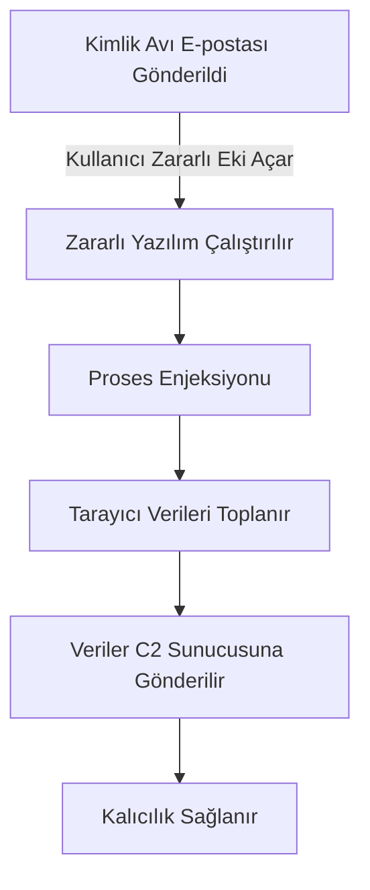
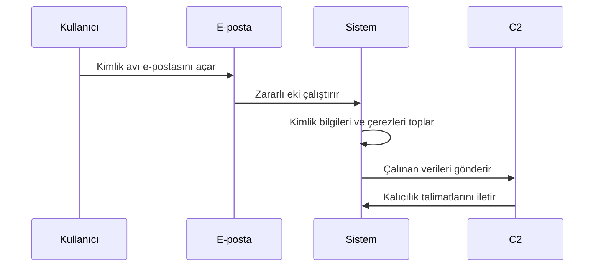
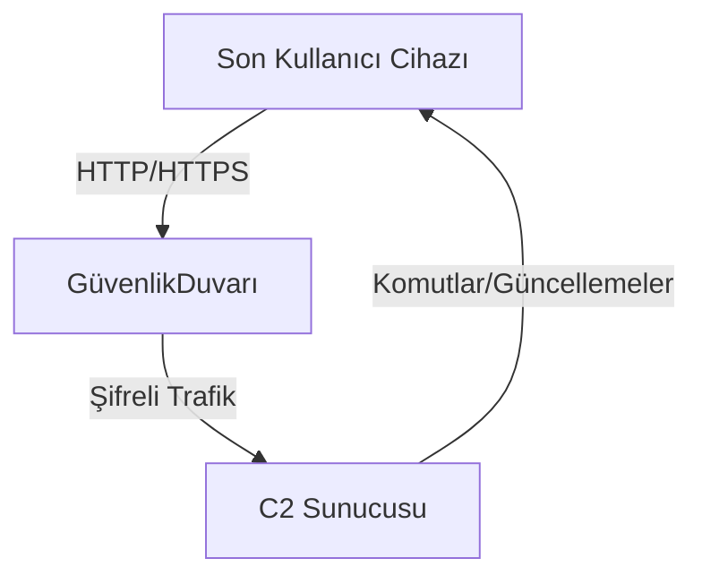

## Genel Bakış
LummaC2, 2024 yılında öne çıkan, özellikle tarayıcılar ve sistemlerden hassas bilgiler çalan sofistike bir bilgi çalma zararlısıdır. Çerezlerin, kimlik bilgileri ve diğer kritik verilerin toplanmasıyla kurumsal sistemlerde yetkisiz erişimi mümkün kılar. Özellikle çok faktörlü kimlik doğrulamayı (MFA) aşma kabiliyeti, modern güvenlik önlemlerine meydan okuyan bir tehdit olarak öne çıkar.

Bu zararlının dikkat çekici özelliklerinden biri, dolaylı kontrol akışları ve karartma teknikleriyle analiz süreçlerini zorlaştırmasıdır. Ayrıca, zararlı yazılımın farklı platformlarda (Windows, Linux, IoT) çalışabilmesi, geniş bir hedef yelpazesi sunar. (Kaynaklar: [SilentPush Blog](https://www.silentpush.com/blog/lummac2/), [Google Cloud Threat Intelligence](https://cloud.google.com/blog/topics/threat-intelligence/lummac2-obfuscation-through-indirect-control-flow))

---

## Temel Özellikler

### Bulaşma Yöntemleri
- **Ana Dağıtım Yöntemleri:**
  - Kimlik avı e-postaları yoluyla zararlı ekler veya bağlantılar.
  - Sahte yazılım güncellemeleri veya korsan uygulamalar.
  - Güvenlik açıklarından yararlanma.
  - Sosyal mühendislik teknikleriyle hedef odaklı saldırılar.

### Kabiliyetler
- Tarayıcı ve şifre yöneticilerinden kimlik bilgilerini çalma.
- Çerezlerin çalınması yoluyla MFA atlatma.
- Dinamik DNS hizmetlerini kullanarak C2 (Komuta ve Kontrol) sunucularıyla sürekli bağlantı.
- Dolaylı kontrol akışıyla analiz süreçlerini zorlaştırma.
- İleri düzey şifreleme ve karartma teknikleri.
- Çoklu platform desteğiyle geniş hedef yelpazesi.

---

## Teknik Detaylar

### Başlangıç Aşaması
1. **Dağıtım:** Zararlı yazılım genellikle kimlik avı e-postaları aracılığıyla gönderilir. Kullanıcılar, sahte yazılım güncellemeleri veya meşru görünen ekler yoluyla yazılımı çalıştırmaya teşvik edilir.
2. **Çalıştırma:** Çalıştırıldığında, zararlı yazılım sistem süreçlerine entegre olur ve antivirüs yazılımlarından kaçınmak için karartma yöntemlerini kullanır. 

### Çalıştırma Akışı

### Davranış Analizi
- **Dolaylı Kontrol Akışı Kullanımı:** LummaC2, statik analiz araçlarını yanıltmak için dolaylı kontrol akışı tekniklerini kullanır. (Kaynak: [Google Cloud Threat Intelligence](https://cloud.google.com/blog/topics/threat-intelligence/lummac2-obfuscation-through-indirect-control-flow))
- **Ağ İletişimi:**
  - C2 sunucularıyla şifrelenmiş HTTP/HTTPS protokolleri kullanılarak bağlantı kurar.
  - Veri paketlerini meşru ağ trafiğine benzer şekilde maskeler.
- **Oluşturulan Dosyalar:** Zararlı yazılım, kalıcılığı sağlamak için sistem dizinlerine DLL veya EXE dosyaları bırakır.

### Bulaşma Göstergeleri (IoC'ler)
#### **Dosya Hash'leri:**
  - `SHA256: 960aa535a9712242c02a82c1f07530ae60e79bcbab15fcf0ebc6e7dbd636710b`
  - `SHA256: cf33803ead9f221274a5ef6bfd8121dce055921bbf7b8053624f22277fb00f90`
  - `SHA256: 6e7b661fb3b6610bc026dd050824e7faaf3bd3b5fa0b168d941858fc694ba871`

#### **IP Adresleri:**
- 144.76.173[.]247
- 195.123.226[.]91
- 45.9.74[.]78
- 77.73.134[.]68
- 82.117.255[.]127
- 82.118.23[.]50

#### **Alan Adları:**
- gstatic-service[.]io
- scandimyth[.]xyz
- sisadmin-my[.]xyz
- stoptme[.]xyz
- privategame[.]xyz
- traftech[.]pro

---

## Etkiler
- **Kimlik Bilgisi Hırsızlığı:** Tarayıcı ve şifre yöneticilerinden alınan bilgiler, saldırganların yetkisiz erişim sağlamasına olanak tanır.
- **Operasyonel Aksama:** Zararlının neden olduğu bilgi sızdırma ve sistem değişiklikleri operasyonel aksaklıklara yol açabilir.
- **Mali Kayıp:** İhlal sonucu oluşan doğrudan ve dolaylı maliyetler.
- **Gizlilik İhlali:** Çalınan veriler, şirketin prestijine zarar verebilir.

---

## Öneriler

### Acil Eylemler
1. **Tespit:** IoC'leri tespit etmek için güvenlik araçlarını güncelleyin ve tarama gerçekleştirin.
2. **İzolasyon:** Etkilenen cihazları ağdan ayırarak karantinaya alın.
3. **Adli Analiz:** Zararlının davranışını anlamak için derinlemesine analiz yapın.

### Önleyici Tedbirler
- **E-posta Güvenliği:**
  - Kimlik avı filtreleme sistemlerini uygulayın.
  - Kullanıcı eğitimi ile sosyal mühendislik saldırılarına karşı farkındalık oluşturun.
- **Ağ Güvenliği:**
  - DNS tabanlı filtreleme kullanarak zararlı alan adlarını engelleyin.
  - Egress filtreleme ile bilinmeyen IP'lere bağlantıları sınırlandırın.
- **Yama Yönetimi:** Sistem yazılımlarını düzenli olarak güncelleyin.
- **Gelişmiş Tehdit Algılama:** EDR araçlarını etkin bir şekilde kullanarak ağ aktivitelerini izleyin.

---

## Görselleştirme

### Zararlı Yazılım Bulaşma Akışı

### Ağ İletişim Diyagramı

---

## Sonuç
LummaC2, dolaylı kontrol akışı ve şifreleme teknikleriyle modern güvenlik önlemlerini aşabilen, sofistike bir tehdit olarak öne çıkmaktadır. Bu zararlının etkilerini azaltmak için proaktif güvenlik önlemlerinin yanı sıra etkili bir olay müdahale stratejisi gereklidir.

---

## Referanslar
- [SilentPush Blog](https://www.silentpush.com/blog/lummac2/)
- [Google Cloud Threat Intelligence](https://cloud.google.com/blog/topics/threat-intelligence/lummac2-obfuscation-through-indirect-control-flow)
- [SOCRadar Analiz](https://socradar.io/malware-analysis-lummac2-stealer/)
